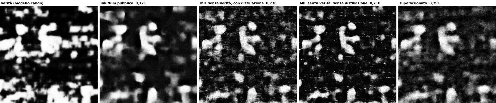

# Geometry-guided fine-tuning of `ink_9um`: negative on one crop, mechanism measured

The [from-scratch MIL test](mil_pherc1667.md) showed that writing geometry
alone teaches a small network very little on 2.6 cm². The obvious rescue was to
start from a detector that already half-works on the new scroll: take the
public `ink_9um` checkpoint (pixel AUC 0.771 on this crop, see the
[positive control](positive_control_pherc1667.md)) and fine-tune it with the
row/interline loss, so the geometry only has to correct it, not invent it.

## Setup

Same data and protocol as the from-scratch test: PHerc1667 w028 crop, 27
slices at 9.6 µm, training on x < 1144 (a 256 px held-out strip up to the split
is kept for the guards), evaluation on x ≥ 1400 only, pixel AUC on a 4×4-pooled
grid against the team's published prediction.

- **Model**: the public `hybrid_3d2d-seed43/step-075000` checkpoint (34.5 M
  parameters), loaded through a verified re-implementation of villa's inference
  (`docs/experiments/ink9um_api.py`, correlation 0.99998 with the Kaggle output).
- **Trainable**: the decoder and the head (4.3 M parameters), encoder and 3D
  stem frozen; AdamW, 400 steps × batch 16, fp16 on a Kaggle T4.
- **Safeguards**: a per-group trust region (2 % encoder/stem, 10 %
  decoder/head, never reached: 0 clips in every arm), an L2-SP penalty toward
  the pre-trained weights, and self-distillation toward the frozen teacher.
  Guards with bootstrap-calibrated thresholds, two-strike patience and
  rollback; for the truth-free arm every enforced signal comes from the
  public model's bands, never from the truth.
- **Arms**: baseline (no training), `mil_free` (row bags from the public
  model — the arm that could be used on an unread scroll), `mil_oracle` (row
  bags from the truth), `supervised` (per-pixel labels, the upper bound).

Script: `docs/experiments/mil_finetune_ink9um.py`, written by three independent
implementations, nine adversarial reviews and a synthesis, then refuted by three
verifiers (guards that could not fire, a noise-level threshold that killed
healthy runs, truth leaking into the truth-free arm's guards, unusable Kaggle
cells), fixed in two rounds and re-verified. Kaggle cells:
`docs/experiments/KAGGLE_mil_finetune.md`. Run time 9 min on a T4.

## Result

| arm | AUC all | AUC within rows | Δ vs baseline | row-vs-interline AUC | status |
|---|---|---|---|---|---|
| `ink_9um` map from villa's `infer.py` (control run) | 0.7714 | 0.7623 | — | 0.610 | — |
| baseline (this pipeline) | **0.7714** | **0.7623** | 0 | 0.610 | not trained |
| `mil_free` | 0.7377 | 0.7467 | **−0.034** / −0.016 | 0.577 | 400 steps |
| `mil_oracle` | 0.7547 | 0.7598 | −0.017 / −0.003 | 0.576 | 400 steps |
| `supervised` (trained on the canon prediction) | 0.7909 | 0.7855 | +0.020 / +0.023 vs canon; **−0.015 vs official labels** | 0.611 | 400 steps |

1. **The pipeline is exact.** The baseline arm reproduces the map that villa's
   own `infer.py` produced for the positive control to four decimals of AUC on
   the T4 (gap 1.4 × 10⁻⁵), so every delta below comes from training, not from
   the pipeline.
2. **Geometry-guided fine-tuning makes the detector worse.** The truth-free arm
   loses 3.4 points, the oracle arm 1.7. The thing the loss was meant to teach
   got worse too: row-vs-interline separation on the test half drops from 0.610
   to 0.577.
3. ~~The machinery can improve the model: with real labels the same fine-tuning
   gains 2 points (0.771 → 0.791).~~ Withdrawn: those "labels" were the canon
   prediction, and against the official labels the same arm loses 1.5 points
   (see the next section).
4. **The guards behaved correctly** — and that exposes their limit. No clip, no
   rollback, every agreement dip correctly read as monitor noise (e.g.
   agreement 0.922, gap 0.028 against a bootstrap spread of 0.046). But the
   truth diagnostic on the held-out strip, which no guard reads, fell from 0.58
   to 0.51 over the `mil_free` run while every truth-free signal stayed green.
   On an unread scroll this degradation would have been invisible.

## Against the official ink labels (correction, 10 September 2026)

Every number above and below this section scores the maps against the team's
published `canon` **prediction** of w028, and the `supervised` arm was trained
on that same prediction (≥ 128), not on human labels. The Challenge asks
ink-detection work to be evaluated on its public `ink-labels` (2026-07)
dataset, which has w028. Aligned to the crop (sharp interior optimum, see
`docs/experiments/eval_official_labels_1667.py`), its validation region covers
11.2 % of the held-out half and none of the training half: 314 804 pixels,
23.8 % ink. Same pixels, two references:

| map | vs official labels | vs canon prediction |
|---|---|---|
| canon prediction itself | 0.930 | — |
| baseline (public `ink_9um`) | **0.886** | 0.816 |
| `supervised` (trained on the canon prediction) | **0.871 (−0.015)** | 0.822 (+0.006) |
| `mil_free`, with distillation | 0.845 (−0.041) | 0.775 |
| `mil_free`, without | 0.800 (−0.086) | 0.738 |
| `mil_oracle`, with / without distillation | 0.841 / 0.843 | 0.778 / 0.782 |

**The "+0.020 with labels" result does not survive.** On the same pixels, the
arm trained on the canon prediction moves slightly toward it (+0.006) and
away from the official labels (−0.015). The canon model marks 35.6 % of these
pixels as ink where the official labels mark 23.8 %; fine-tuning taught
`ink_9um` to imitate that bias, not to see ink better. This experiment never
had human labels in training, so it says nothing about whether a few cm² of
them would help. What it does show is the same trap as the guard in the next
section: **optimise toward a reference and you will measure a gain against it.**

**The geometry result survives and strengthens.** Every MIL configuration
loses 4 to 9 points against the official labels.

## The confound test: removing the distillation anchor

The first run suggested a confound. The self-distillation anchor acts with
weight 1 on exactly the interline pixels, pulling them toward the teacher's own
predictions (≈ 0.34 there), while the MIL negative term pushes the same pixels
to 0; the supervised arm, which ran without distillation, improved. If the anchor
was cancelling the one certain part of the geometric signal, removing it should
help. Second run: both MIL arms with the anchor restricted to weight space
(`--anchor l2sp`: L2-SP + trust region, no distillation), everything else
identical.

| arm | anchor | AUC all | AUC within rows | row-vs-interline | status |
|---|---|---|---|---|---|
| baseline | — | 0.7714 | 0.7623 | 0.610 | not trained |
| `mil_free` | L2-SP + distillation | 0.7377 | 0.7467 | 0.577 | 400 steps |
| `mil_free` | L2-SP only | **0.7096** | 0.7249 | 0.555 | guard fired at step 125 → rolled back to pristine, lr × 0.3, then 275 more steps |
| `mil_oracle` | L2-SP + distillation | 0.7547 | 0.7598 | 0.576 | 400 steps |
| `mil_oracle` | L2-SP only | 0.7600 | 0.7623 | 0.583 | guard fired twice → **stopped at step 175**, scoring step 25 |
| `supervised` (on canon prediction) | L2-SP (run 1; distillation is off for this arm) | 0.7909 | 0.7855 | 0.611 | 400 steps |

**The hypothesis was wrong.** Without the distillation anchor the truth-free arm
degrades twice as much (−0.062 instead of −0.034), and the oracle arm is stopped
by its guard after being caught degrading twice. The anchor was not suppressing a
useful signal; it was limiting the damage. Its negative-term trace confirms it: over
the first 125 steps, at the same learning rate and before any rollback, the
interline loss fell as much with distillation (0.461 → 0.431) as without it
(0.469 → 0.444). Had distillation been cancelling the negatives, removing it
would have let that loss fall faster; it did not.

## What the two runs establish

1. **Writing geometry, used as the only supervision, does not improve a
   pre-trained ink detector on a new scroll — it degrades it.** Four MIL
   configurations (two band sources × two anchors), all below the baseline,
   against the canon prediction and against the official labels alike. The same result as the from-scratch
   test, now from the strongest starting point available. The positive term
   (top 30 % of each row band pushed to 1) is self-referential: with 43-48 % of
   row-band pixels actually ink, it reinforces the detector's own ranking,
   errors included, and the interline negatives are too coarse to correct it.
   On this crop the idea is negative; more training area was not tried.
2. **Fine-tuning toward another model's predictions moves toward that model, not
   toward the ink.** Trained on the canon prediction, `ink_9um` agrees a little
   more with canon and less with the official labels (−0.015). The earlier claim
   that about 2 cm² of labels (the 11.0 × 19.2 mm training strip) improve the public model rested on scoring against the
   training reference; it is withdrawn. Whether a few cm² of *human* labels help
   is not tested here.
3. **A truth-free guard is only as good as its independence from the loss.**
   In the first run the guard measured teacher/student agreement on interline
   pixels, and the distillation term enforced exactly that agreement — so the
   guard was blind by construction and stayed green while the truth diagnostic
   fell from 0.58 to 0.51. With distillation removed, the same guard fired in
   both geometry arms. In the truth-free arm it fired once and rolled training
   back to the pristine weights, but the resumed run still ended as the worst
   model of the study (0.710); only the oracle-band arm, whose guard reads
   truth-derived bands, was stopped. Independence let the guard *see* the
   degradation; it did not prevent it. Any self-supervised pipeline run on an
   unread scroll inherits the first half of this lesson: a monitor that the
   objective optimises cannot tell you the objective is wrong.

## Where the loss comes from

The MIL maps look *sharper* than the public model's — the central glyph has crisp
edges — so the first worry was that the metric, whose truth is itself a smooth
model prediction, penalises sharpness. It does not. Every number below is
recomputed from the saved probability maps with code independent of the
training script (all seven maps reproduce the script's AUCs to four decimals).

**1. The gap is not a fine-scale artefact.** Pixel AUC at five pooling scales:

| map | 19 µm | 38 µm | 77 µm | 154 µm | 307 µm |
|---|---|---|---|---|---|
| baseline | 0.772 | 0.771 | 0.773 | 0.777 | 0.785 |
| `mil_free`, with distillation | 0.738 | 0.738 | 0.742 | 0.752 | 0.770 |
| `mil_free`, without | 0.711 | 0.710 | 0.715 | 0.726 | 0.750 |
| supervised | 0.792 | 0.791 | 0.793 | 0.800 | 0.807 |

About half of the loss survives averaging over 0.3 mm cells, so it is not
speckle alone. The sharpness is real but indiscriminate: the high-frequency
energy (mean |Laplacian|) of the MIL maps doubles on ink *and* on background
(0.012 → 0.027 on ink, 0.011 → 0.024 on background); the fine decoder layers,
which drifted most, learned fibre texture along with stroke edges.

**2. The loss is concentrated where the geometry claimed certainty.** AUC by
region of the test half (oracle bands):

| map | row bands | interlines | mixed |
|---|---|---|---|
| baseline | 0.762 | 0.768 | 0.772 |
| `mil_free`, with distillation | 0.747 (−0.016) | **0.716 (−0.053)** | 0.729 (−0.043) |
| `mil_free`, without | 0.725 (−0.037) | **0.695 (−0.074)** | 0.692 (−0.080) |
| supervised | 0.786 | 0.788 | 0.788 |

**3. The "certain negatives" are not certain.** In the training half, **13.6 % of
the pixels the truth-free arm labelled as certain negatives are ink** (7.1 % with
the oracle bands), and in the test half **20 % of all ink lies inside interline
bands**: ascenders and descenders, and rows that do not sit where the row profile
says. The premise of the idea — interlinear gaps are guaranteed ink-free —
holds for a row profile but not at the pixel level for this hand. A loss that
treats one negative in seven as certain teaches the detector to suppress a
specific, recurring kind of ink.

So the failure has a measured mechanism, not a guessed one: noisy negatives,
concentrated outside the row bands, plus indiscriminate high-frequency gain in
the fine decoder. The one variant left untested would train only the head (no
fine-decoder texture) on the central core of each interline gap (fewer
contaminated negatives). The positive term would still be self-referential,
and no arm in this study beat the untouched public model against the official
labels; it is not worth a run.

## Caveats

- One seed per configuration, one crop, one segment, 400 steps. The direction
  is consistent across all four MIL runs (all below baseline, against both
  references); the supervised run is above against the canon prediction and
  below against the official labels. The size of each gap is single-seed.
- The main tables score against the canon prediction; the official-label table above covers only the 11 % of the held-out half that the ink-labels dataset annotates.
- The input is a 2.4 µm ESRF volume resampled to 9.6 µm, not a native 9 µm
  scan.
