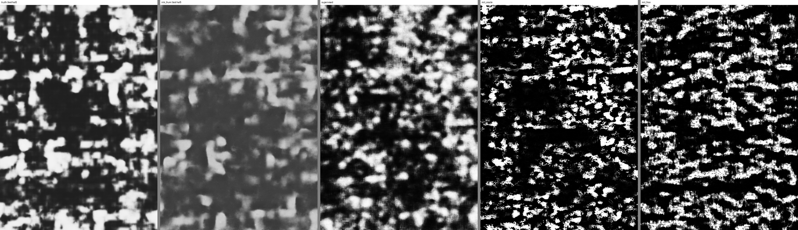

# Can writing geometry teach a network what ink looks like? First test

The public models learn *what ink looks like* on one scroll and carry it
poorly to others. What does not change between scrolls is the *geometry of
writing*: rows at a regular pitch, and interlinear gaps that are guaranteed
ink-free. The idea tested here inverts the usual order — use the geometry as
the only supervision and let a network learn the appearance of ink on the
target scroll by itself. Formally, multiple-instance learning (MIL): every
pixel in an interline band is a certain negative; every text-row band is a
bag that contains ink somewhere.

## Setup

Data: the PHerc1667 w028 crop of the [positive control](positive_control_pherc1667.md)
(27 slices at 9.6 µm, 27 × 19 mm, text everywhere; truth = the team's
published `canon` prediction, ink if ≥ 128). Training on the left half
(x < 1400 px), evaluation on the right half only. Row bands from the row
profile of the training half: `oracle` (from the truth) and `free` (from the
public `ink_9um` prediction, never from the truth; 67 % agreement with the
oracle; ink fraction 0.43 in its row bands vs 0.19 in its interlines).

Network: a 2D U-Net with the 27 slices as input channels, 1.9 M parameters,
identical initialisation, patch sequence (128 px, 2400 steps of 16) and
evaluation across three arms:

- **supervised** — per-pixel BCE against the truth (upper bound for this
  network and this much data);
- **mil_oracle** — negatives: BCE→0 on interline pixels; positives: BCE→1 on
  the top 30 % of predicted probabilities inside the row-band pixels of each
  patch; a hinge prior keeping the row-band mean probability in [0.2, 0.6];
- **mil_free** — the same with the `ink_9um`-derived bands.

Metric: pixel AUC against the truth on a 4×4-pooled grid (38 µm) over the test
half, and within oracle row bands only. `ink_9um` (trained on a whole scroll
with labels) goes through the same evaluator. Script:
`docs/experiments/mil_train_1667.py` (three independent implementations,
nine adversarial reviews, synthesis, three verifiers; smoke test on CPU, real
run on a Kaggle T4 in 8.5 min); data: `docs/experiments/build_mil_1667.py`.

## Result (seed 42)

| map | AUC all | AUC within rows | row-vs-interline AUC on the test half |
|---|---|---|---|
| `ink_9um` (public, scroll-trained) | **0.771** | 0.762 | 0.61 |
| supervised (on the canon prediction, this crop) | 0.662 | 0.609 | 0.56 |
| mil_oracle | 0.537 | 0.532 | 0.51 |
| mil_free | 0.552 | 0.533 | 0.56 |

Three things the numbers say.

1. **Geometry alone taught very little here.** The MIL arms end at 0.54-0.55,
   a third of the way from chance to the supervised arm. Their maps are
   near-binary blotches (mean 0.21-0.25, std 0.34) with horizontal streaks.
2. **They did not simply learn "where the rows are".** On the test half the
   MIL maps separate row-band cells from interline cells no better than
   chance (0.51-0.56; the row profile explains 5 % of their variance),
   while their training loss was low (negatives 0.07, positives 0.06). So the
   network memorised the texture of the specific training rows and it did
   not transfer to new rows 14 mm away. With 13 cm² of training area, MIL
   overfits before it generalises.
3. **The supervised arm is data-starved too.** Trained on the canon prediction
   over the same 13 cm², the same network reaches 0.66 — below the 0.77 of a
   model trained on a full scroll. The ceiling of this experiment is set by area, not by
   labels; the MIL result must be read against 0.66, not 0.77.

**Against the official labels** (public `ink-labels` 2026-07, validation
region, 11.2 % of the held-out half; `docs/experiments/eval_official_labels_1667.py`):
supervised 0.678, `mil_oracle` 0.513, `mil_free` 0.509, public `ink_9um` 0.886.
The MIL arms are at chance. Note that "supervised" here means trained on the
canon *prediction*, not on human labels.

## Verdict, and what would change it

Against the canon prediction the negatives-from-interlines signal looked
marginally present (0.55 > 0.50, with two different band sources); against the
official labels both MIL arms are at chance (0.51). In its minimal form and at
this scale the idea gives nothing measurable. Two changes are worth
the next experiment, in this order:

- **Scale.** All 19 segments of PHerc1667 with published predictions
  (hundreds of cm²), not one crop, and rows derived from the public model
  everywhere. Both arms will rise; the question is whether MIL closes the gap
  to supervised as area grows, which is the only thing that would make it
  useful on an unread scroll.
- **Geometry-guided fine-tuning of `ink_9um` instead of training from
  scratch.** `ink_9um` already localises ink on a new scroll (0.77 here). The
  row/interline loss can be applied to *its* outputs on the target scroll,
  starting from the pre-trained weights: the geometry would then only have to
  correct a detector that half works, not invent one. This is the version of
  the idea most likely to matter for PHerc1203, where no truth exists and the
  public model gives blotches.

Not worth doing: more epochs or a bigger network on the same crop (the
overfitting says so), or pixel-level physical features (the previous test
gave 0.50-0.61).

## Reproducing

    python3 docs/experiments/build_mil_1667.py                      # data package (needs the control-run files)
    python3 docs/experiments/mil_train_1667.py --data work/mil_1667/mil_1667_w028.npz --out out/mil --arm all --smoke   # CPU check
    # Kaggle T4: same command without --smoke, --epochs 12 --steps-per-epoch 200 --batch-size 16 --patch 128 --seed 42
