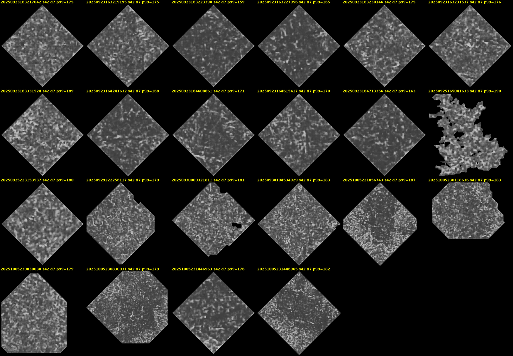
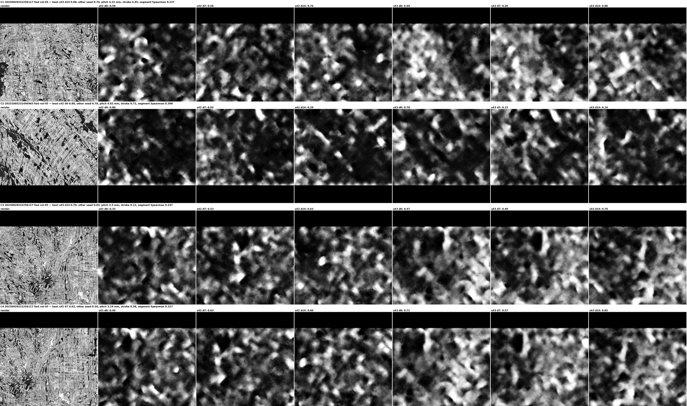

# PHerc. 1203: twenty-two segments rendered and run, no text

PHerc1203 is Grand-Prize-eligible and had no ink prediction of any kind. Its
22 public `raw/auto_grown` meshes (September-October 2025, 3-16 cm² each,
distinct bounding boxes) were rendered locally at the scan's 9.362 µm — the
resolution `ink_9um` was trained at — with `vc_render_tifxyz`
(docs/RENDERING.md; six renderer processes in parallel, 5-23 min per segment,
5.5 GB in all), run through `ink_9um` on a free Kaggle session (two T4s, one
seed each, `--batch-size 16`; docs/experiments/kaggle_ink9um_sweep.sh; 264
predictions in 2 h 20 min), and scored with ScrollRank v0.8 at 0°, +45° and
−45°, masked to the mesh:

    SCROLL=1203 python3 docs/experiments/sweep_pherc1447_auto.py

The meshes are good: fibre texture uniform, coverage 46-73 % of the render
rectangle, no stray strips. Fibres run diagonally in these renders, as on
PHerc0800, hence the ±45° passes.

## Result

| | |
|---|---|
| predictions × angles scored | 792 (about 67 000 windows) |
| windows above 0.6 | 74 (13 at 0°, 25 at +45°, 36 at −45°) |
| above-threshold windows with the other seed ≥ 0.5 in the same cell | 10 (chance: 0.8) — all ten at −45°, in two segments |
| seed-42/seed-43 Spearman, per segment/depth/direction | median **0.15**; max 0.71 on 30 windows whose scores stay below 0.21 |
| reference, text present (w035) | 0.78 |

No segment shows seed concordance anywhere near a text-bearing one, and the
predictions are uniform speckle over the whole mesh at every depth and in
both directions (figure above; on PHerc0139 w035 the same pipeline draws
legible letters).

## The two places both seeds pointed at

Ten windows crossed the threshold with the other seed above 0.5 in the same
cell, twelve times more than chance. They sit in two segments and were
inspected at full resolution: render, both seeds, all three depths.

- **222256117, top edge, −45°, depth 14-30** (rows C1, C3, C4): three
  adjacent windows, 0.86 / 0.70 / 0.63 with the other seed at 0.74 / 0.63 /
  0.57, pitch 3.2-4.2 mm; both seeds are elevated at all three depths. The
  windows sit against the mesh boundary and the render underneath shows
  crumpled, folded papyrus. The predictions are blotches with no rows.
- **231446965, −45°, depth 0-16** (row C2): one window where seed 42 gives
  0.80 and seed 43 gives 0.78, pitch 4.0 mm, stroke 0.71 — depth-specific
  (0.02-0.29 at the other depths, both seeds). The render shows diagonal
  fibres; the predictions show diagonal streaks following them and round
  blotches. No rows of separated marks.

Both retired. The angle is the tell: every supported window is at −45°, the
rotation that turns these renders' fibre direction horizontal, and none of
the 38 above-threshold windows at 0° or +45° has support. Rotating to catch
tilted writing also aligns the fibre bundles with the periodicity detector,
and the fibre-pitch false positive (3.2-4.2 mm here) becomes the dominant
one. Seed agreement does not help against it: both seeds see the same
fibres.

## What this establishes

On the only eligible scroll scanned at `ink_9um`'s native resolution, with
well-formed meshes and the full depth sweep, the public models show no
detectable text on 22 segments totalling about 150 cm². The negative is
stronger than the PHerc1447 and PHerc0800 ones on every axis but one:
nothing establishes which side of the sheet these meshes lie on.

Together with [pherc1447_predictions](pherc1447_predictions.md),
[pherc1447_auto_sweep](pherc1447_auto_sweep.md),
[screening_pherc1447_raw](screening_pherc1447_raw.md) and
[pherc0800_predictions](pherc0800_predictions.md), every public segment of
the three eligible scrolls that have any has now been run but one (the
PHerc1447 `z_dbg_gen_00320` surface volume): 14 of 15 named + 22 raw meshes of
PHerc1447 (four model families), 6 of PHerc0800, 22 of PHerc1203. Not one window where independent models agree on writing-like
structure and the eye confirms it. About four hours of free GPU and three of
local rendering.

## Two lessons for the tool

1. **Rotation multiplies the fibre false positive.** Scoring at ±45° was
   introduced for tilted writing; on renders with diagonal fibres it hands
   the detector exactly the pattern it is looking for. A structure-tensor
   estimate of the fibre direction, used to *exclude* the fibre angle rather
   than to add angles, is the right fix.
2. **Seed concordance is not evidence against papyrus structure.** Two seeds
   trained on the same data respond to the same fibres. The support count
   (10 against 0.8 by chance) is real and means nothing about ink. Only a
   model trained on different data, or the eye, breaks the tie.
