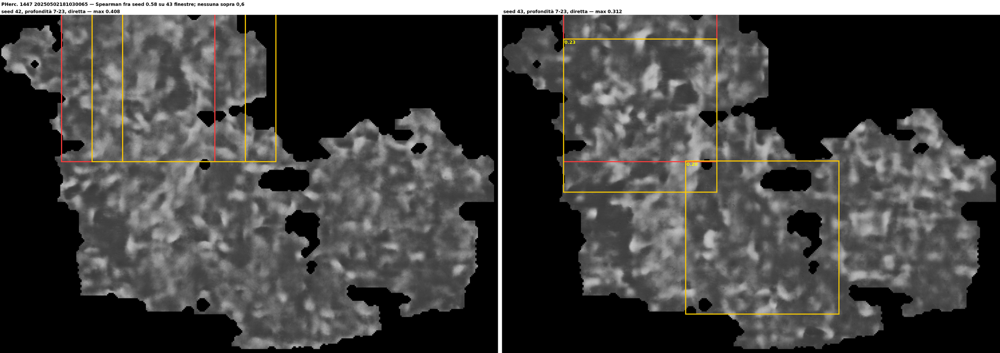

# PHerc. 1447, the eleven unrendered meshes: rendered locally, no text

The fifteen named public segments of PHerc1447 include eleven `auto_grown` meshes
from May 2025 with no surface volume. They were rendered locally with
`vc_render_tifxyz` (docs/RENDERING.md; 5-15 min each, 87-222 MB, seven
renderer processes in parallel are network-bound and safe), run through
`ink_9um` on a free Kaggle session (docs/experiments/kaggle_ink9um_sweep.sh:
seeds 42 and 43 on the two T4s, three depth windows 0-16 / 7-23 / 14-30,
both directions; 131 of 132 predictions, one lost to the download), and scored
with ScrollScout v0.8 at 0°, +45° and -45°, masked to the mesh:

    python3 docs/experiments/sweep_pherc1447_auto.py

## Result

| | |
|---|---|
| predictions × angles scored | 393 |
| windows above 0.6 | **0** (highest anywhere: 0.577) |
| seed-42/seed-43 Spearman, segments with ≥ 29 windows | 181030065: −0.23 to **0.58**; 164121265: ≤ 0.36 |
| reference, text present (w035) | 0.78 |

The predictions are uniform blotches over the whole mesh at every depth and
in both directions, the same picture as on the three pre-rendered segments
([pherc1447_predictions](pherc1447_predictions.md)). The one row with a
concordance worth naming — segment 181030065, default depth, forward, 0.58 on
43 windows — has a best score of 0.41, well under threshold, and the same
segment gives −0.07 and −0.23 at the other two depths. Nothing to follow up.

## What limits this run: the meshes

These eleven meshes are the first automatic segmentations of this scroll and
they show it. Coverage of the render rectangle is 5-57 %; several carry thin
strips that cut across the volume obliquely (the render then shows stacked
layers of the roll, not a sheet), and the fibre texture waves where the mesh
crosses the sheet at an angle. Two consequences for the scoring:

- **Few windows.** A 10 mm window needs 80 % of its area on the mesh. Per
  segment that leaves 0-43 windows; two segments yield none at all, and only
  two have more than twenty. The concordance values above 0.8 in the summary
  table all come from 5-13 windows and mean nothing.
- **The mask matters.** The model writes nonzero output wherever a 128-px
  patch touched the mesh, which on these sparse renders is up to four times
  the mesh area; the scorer's auto-mask would have let that through. The mask
  here is the union of nonzero voxels of the render stack.

So this is a weaker negative than the one on the three pre-rendered segments:
same models, same answer, but on meshes that a better segmentation would
replace. Together the two runs cover fourteen of the fifteen named segments of
the scroll at three depths, two seeds, both directions; the fifteenth, the
`z_dbg_gen_00320` surface volume, is not yet run.

## Reproducing

Renders: `work/render_worker.sh` (lock-based, several in parallel). GPU half:
the Kaggle script, two cells, about 50 minutes for the eleven segments once
`--batch-size 16` is used (the default 4 left the T4 at 25 % and made the run
ten times slower). Scoring: the script above, seven minutes on eight cores.
