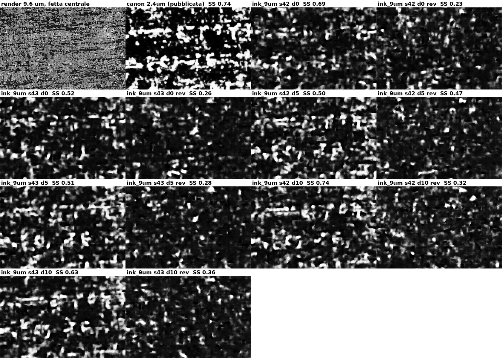

# Positive control: does `ink_9um` find text that is known to be there?

Every negative in this repository — PHerc1447 (16 + 22 segments), PHerc0800
(6), PHerc1203 (22) — was obtained with the public `ink_9um` models, trained
on PHerc0139. None of it distinguishes "no ink" from "no ink these models can
see". The control that separates the two is a scroll other than PHerc0139
with text that is already read.

## Setup

PHerc. 1667 was unwrapped and read in full from its 2.399 µm ESRF scan. Its
segment **w028** carries dense Greek text over the whole surface, as the
team's published `new_canon_autoresearch` prediction shows. The surface
volume is 2.399 µm with 109 slices; `ink_9um` expects ~9 µm. So the input was
built as the model would see it: pyramid level 2 of the surface volume
(9.596 µm in x and y) and every fourth slice in z (27 slices, 9.6 µm apart),
on a text-dense crop of 27 × 19 mm (ds8 preview region x 300-1700,
y 2300-3300; 391 uncompressed chunks, 700 MB, fetched straight from the
bucket). Then the usual Kaggle sweep: seeds 42 and 43, depth windows 0-16,
5-21, 10-26 of the 27 slices, both directions — 12 predictions. Scored with
ScrollScout v0.8 at 10 mm / 2 mm, and compared window by window with the
published prediction of the same crop (same grid: both crops are 26.9 mm
wide).

## Result

| | score max | p95 | pitch | Spearman vs published | Spearman vs other seed |
|---|---|---|---|---|---|
| published `canon` 2.4 µm prediction | 0.737 | 0.49 | 4.9 mm | — | — |
| `ink_9um` s42, depth 0-16, fwd | 0.692 | 0.35 | 4.9 | **−0.42** | −0.02 |
| `ink_9um` s43, depth 0-16, fwd | 0.517 | 0.32 | 4.3 | −0.02 | −0.02 |
| `ink_9um` s42, depth 5-21, fwd | 0.497 | 0.45 | 4.5 | −0.26 | 0.69 |
| `ink_9um` s43, depth 5-21, fwd | 0.509 | 0.38 | 4.3 | −0.33 | 0.69 |
| `ink_9um` s42, depth 10-26, fwd | 0.741 | 0.51 | 4.8 | −0.11 | 0.53 |
| `ink_9um` s43, depth 10-26, fwd | 0.626 | 0.56 | 4.6 | −0.08 | 0.53 |
| `ink_9um`, all six reverse runs | 0.23-0.47 | 0.16-0.39 | 3.1-4.8 | −0.12 to 0.27 | −0.08 to 0.25 |

**Two measures, two answers — and the second corrects the first.** Compared
by ScrollScout window rankings, the twelve `ink_9um` runs do not agree with
the published model (Spearman −0.42 to 0.27). But this crop is text from edge
to edge, and ranking windows inside a fully written area is exactly what the
tool cannot do (see benchmark_pherc0139.md); that comparison was the wrong
instrument. Measured **pixel by pixel** — does `ink_9um` fire where the
published model draws letters? — the answer is a partial yes:

| pixel AUC vs published letters (38 µm grid) | depth 0-16 | 5-21 | 10-26 |
|---|---|---|---|
| seed 42 / 43, forward | 0.72 / 0.71 | **0.76 / 0.76** | 0.75 / 0.76 |
| seed 42 / 43, reverse | 0.50 / 0.50 | 0.50 / 0.55 | 0.49 / 0.51 |

The forward predictions are blotchy and blurred, not letters, but the blotches
sit where the letters are. `ink_9um` transfers to PHerc1667 **partially**:
enough to localise ink at the 0.1 mm scale, not enough to draw a glyph. The
reverse direction is near chance in every run (0.49-0.55).

*Correction (10 September 2026).* An earlier version of this page read the
reverse runs as "the model sees nothing from the wrong face of the sheet" and
called direction asymmetry "a cheap and reliable sign of a written side". That
is wrong. villa's reverse direction is not the other face of the sheet: it
feeds the *same* 17 slices in the opposite depth order. The asymmetry therefore
says only that `ink_9um` is not invariant to a depth flip — it learned ink at a
particular position in the stack — and nothing about which side carries
writing. A model trained with depth-flip augmentation, which is what one would
want (point made by the segmentation team on Discord), should see the ink in
both orders, and the asymmetry would disappear with it. What remains useful is
practical: with the public checkpoint, check both orders on a new segment and
keep the one the model can read; on PHerc1447 and PHerc1203 neither order was
readable.

ScrollScout's own score would have been fooled either way — 0.74 at the right
pitch on blotches — one more instance of the band-and-blotch false positive,
here on real text. And the two seeds agree with each other (0.53-0.69) more
than either agrees with the published letters at window level: seed agreement
measures shared structure, not ink.

## What it means for the negatives

On the one test with known text on another scroll, `ink_9um` transfers
partially: pixel AUC 0.76 where the published model puts letters, but no
legible glyphs, and only in one depth order. Read the negatives on PHerc1447,
PHerc0800 and PHerc1203 accordingly: a blurred, weakened version of the ink
signal may be present in those predictions without ever forming rows that
ScrollScout or the eye can recognise — *the model sees dimly*, not *there is
no ink*, and not *the model is blind* either. The pixel-level test against a
second model, not the window ranking, is the right instrument for this
question; it is now in the repo.

## Caveats

- The input is a 2.4 µm ESRF volume resampled to 9.6 µm, not a native ~9 µm
  scan like the training data; scanner, energy and noise differ. A native
  7.91 µm control (the 2023 Diamond scans of PHerc1667 or PHercParis4, whose
  classic segments have known text) would be cleaner; those layers live in the
  legacy volpkg behind registration.
- One crop, one segment. Enough to show partial transfer; not a measurement of
  how well the model transfers in general.

## Reproducing

    # build the input (fetches ~700 MB of level-2 chunks, writes a render-style zarr)
    python3 docs/experiments/build_control_pherc1667.py
    # Kaggle: DEPTHS="0-16 5-21 10-26" bash kaggle_ink9um_sweep.sh <dataset>/1667_render
    # score + compare (window rankings, and the pixel-level AUC that settles it)
    python3 docs/experiments/score_control_pherc1667.py
