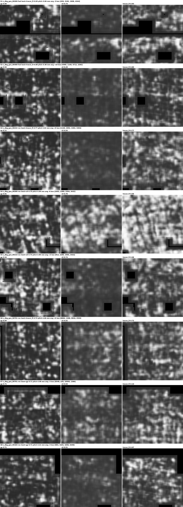

# PHerc. 1447 raw segments: screening the team's published ink predictions

The bucket holds 37 raw meshes for PHerc1447 under `segments/raw/`. Twenty-two
of them (`z_dbg_gen_*`, November 2025) come with ink predictions the Challenge
team already ran, as full-resolution JPG previews (8.64 µm, 1:1 with the
volume): three models — `gp`, `s5`, `tracer_ft` — in both layer directions.
That is 132 predictions on an eligible scroll that nobody had screened, and
none of them needs a GPU. Segment 00701 alone covers a 19 × 23 × 51 mm box.

    python3 docs/experiments/screen_pherc1447_raw.py     # ~7 min on 6 cores

ScrollScout v0.8, 10 mm windows, 2 mm stride, auto-mask on (the JPG background
is exact zero outside the mesh). Per segment and direction: the three score
grids, their pairwise Spearman (the cross-model concordance test), and every
window above 0.6 with the value the other two models give in the same cell.

## Result: no candidate survives

| | |
|---|---|
| windows scored | 27 258 (9 086 per model) |
| windows above 0.6 | 174 (gp 0.4 %, s5 0.6 %, tracer_ft 0.9 % of their windows) |
| cross-model Spearman, per segment and direction | median **0.15**, max **0.39** (00469 fwd) |
| reference: two runs where text is present (w035) | 0.78 |
| reference: shuffled control | 0.09 |
| above-threshold windows where another model is ≥ 0.5 in the same cell | 21 of 174 (chance: 5.7) |

Nowhere do the three models rank the windows of a segment alike. The 174
above-threshold windows are, by the tool's own rule, seen by one model each;
the 21 that a second model supports were inspected by eye, all three models
side by side, at full resolution:

Speckle, blotches, and — in the windows that score highest — broad horizontal
bands 3.5–4 mm apart (00260 fwd, 00215 rev). No rows of separated marks, no
letter-sized components. The bands are what drives `line_periodicity` to 0.9
and above; they are shared by two models because both see the same volume,
which is why the support count (21) exceeds chance (5.7) without anything
being written there. A structure two models agree on is not necessarily ink.

Full table: `out/screen_1447_raw/summary.md` (regenerated by the script).

## What this adds to the PHerc1447 negative

The [earlier negative](pherc1447_predictions.md) covered three pre-rendered
segments, one model family (`ink_9um`), two seeds, three depth windows. This
one covers 22 further segments — much larger ones — and three other model
families, and reaches the same answer by the same criterion. Combined: on
PHerc1447, four model families on 25 segments show no window where
independent models agree on writing-like periodicity.

## Two things the screening exposed about the tool

1. **`line_periodicity` saturates at 1.000 on band-like blotches.** Eleven
   windows hit exactly 1.000 with nothing letter-like in them. On `ink_9um`
   predictions of raw papyrus the score never passed 0.64; these previews are
   texturally different (high-frequency speckle in `gp`, smooth blobs in
   `s5`), and the periodicity measure has no defence against a few broad bands
   at the right pitch. A minimum on the number of periods, or a penalty on band
   width relative to pitch, is the obvious fix; not implemented yet.
2. **Pitch tells fibres from bands, not bands from text.** Windows at 3.1–3.5 mm
   pitch are the fibre-bundle mode already documented in
   [baseline_pherc1447](baseline_pherc1447.md); the 3.7–4.9 mm ones are
   bands. Both would pass a pitch filter set for PHerc0139 handwriting.

## Caveats

- What `gp`, `s5` and `tracer_ft` are — architecture, training scroll,
  resolution — is not documented in the bucket. Asked on Discord.
- The previews are JPGs; compression is visible but at 10 mm windows it is far
  below the scale that matters.
- Nothing establishes which of these raw segments lie on the recto. As with
  [PHerc. 0800](pherc0800_predictions.md), a negative on a verso says nothing
  about ink.
- One depth per model; the team's runs, not ours, so no depth sweep is possible
  without re-rendering.
